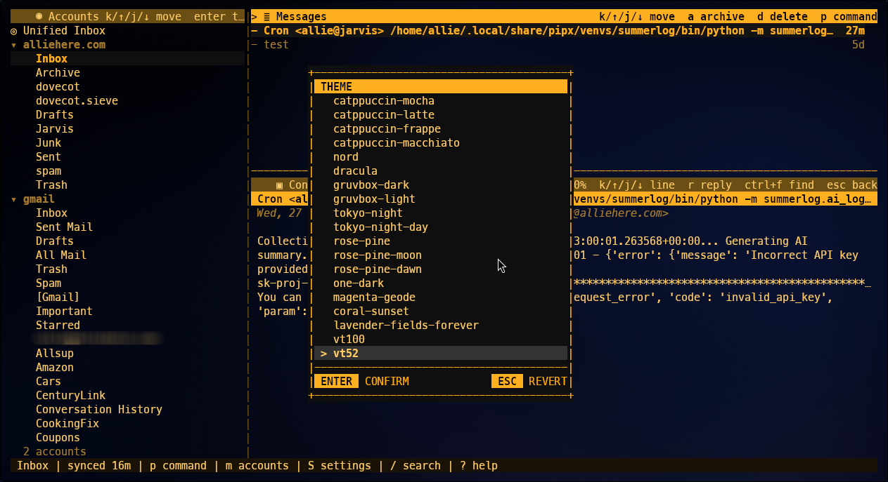

# TideMail



A keyboard-first terminal mail client built with [Bubble Tea](https://github.com/charmbracelet/bubbletea) and [Lipgloss](https://github.com/charmbracelet/lipgloss).

## Install

**Quick install** (Linux/macOS, amd64/arm64):

```bash
curl -fsSL https://raw.githubusercontent.com/allisonhere/tidemail/main/install.sh | sh
```

Or download a binary from the [latest release](https://github.com/allisonhere/tidemail/releases/latest).

**From source:**

```bash
git clone https://github.com/allisonhere/tidemail
cd tidemail
go build -o tidemail .
./tidemail
```

## Features

- Three-pane mail layout: accounts, messages, content
- Unified Inbox across all configured accounts
- Multi-select messages with space bar — auto-advances for bulk delete, archive, move, mark read
- Select all with `A` — selects every message in current view
- Full email headers display — toggle with `ctrl+e`, configurable default in Settings
- Spam/auth headers — SPF, DKIM, DMARC results color-coded in header view
- IMAP/SMTP accounts using passwords, app passwords, or **Gmail OAuth2** (stored in system keychain)
- Account manager for adding, editing, deleting, and discovering mailboxes
- Contacts manager for curated autocomplete, manual entries, adding seen senders, composing to selected contacts, and vCard import/export
- vCard import/export preserves email, display name, phone, organization, title, and notes
- Server-backed sync, read/unread, archive, move, delete, compose, and reply
- Local-first delete hides messages immediately and prevents deleted mail from reappearing on later syncs
- Archive auto-detection via `\Archive`, `Archive`, `Archives`, or `All Mail`
- Command palette for common mail actions
- Search and unread-only filtering
- Optional actionable links in the message content pane
- AI summaries with copy and save-to-Markdown actions
- AI grammar & spell check in compose with preview overlay
- Theme-aware dialogs, overlays, and terminal background sync
- Collapsible account folders (System, Labels) in sidebar
- **Desktop notifications** on genuinely new unread mail via auto-sync (notify-send), with sender and subject details
- **Gmail OAuth2** — sign-in via browser, no app passwords needed

## Usage

```bash
go build -o tidemail .
./tidemail
```

Config is stored in `~/.config/tidemail/config.toml`. The local SQLite cache is stored in `~/.local/share/tidemail/mail.db` unless `XDG_DATA_HOME` changes that path.

Open account management with `M`, add an IMAP/SMTP account, then sync the selected mailbox with `f`. Press `f` on the Unified Inbox to sync every account's inbox at once. Use `F` to sync all mailboxes. Configure a per-account `sync_minutes` interval for automatic background refresh.

Open contacts with `C`. Contacts are the curated address book used for compose autocomplete. Add contacts manually with `n`, add addresses already seen in mail with `f`, import a vCard file with `i`, export to `contacts.vcf` with `x`, select multiple contacts with `Space`, press `c` to compose to the selected contact(s), and delete selected contacts with `d`. vCard import/export keeps email, display name, phone, organization, title, and note fields.

## Credential safety

TideMail stores IMAP/SMTP passwords and AI API keys in the system keychain via `secret-tool` (libsecret on Linux, Keychain on macOS). Empty `password` and `openai_key`/`claude_key`/`gemini_key` fields in the config file are looked up from the keychain at startup. When you save settings, any in-memory secrets are moved to the keychain and removed from the config file automatically.

OAuth2 refresh tokens are also stored in the keychain. Client ID and secret live in the `[oauth]` section of the config file — the defaults are baked into the binary so you never need to set them up.

If `secret-tool` is not installed, passwords, API keys, and refresh tokens fall back to being stored directly in `~/.config/tidemail/config.toml`. Treat the config file like a secret in that case.

- Gmail (password method): Google Account → Security → App passwords
- Gmail (OAuth2 method): sign-in with Google in the account manager — no app passwords needed
- Yahoo: Account Security → Generate app password
- iCloud: Apple ID → Sign-In and Security → App-Specific Passwords

If you paste or accidentally expose an app password or refresh token, revoke it and create a new one.

## Gmail OAuth2

Gmail accounts can use OAuth2 instead of app passwords:
1. Press `M` to open account manager
2. Select your Gmail account and press `Enter` to edit
3. Tab to the **Auth** field and toggle to **OAuth2** (Space or Enter)
4. Tab to **[Sign in with Google]** and press Enter
5. Your browser opens — sign in and grant access
6. Focus jumps to the From field — finish editing and save (Ctrl+S)
7. TideMail authenticates with your refresh token — no password storage needed

On future launches, the refresh token is restored from the keychain automatically.

Example account config:

```toml
theme = "catppuccin-mocha"

[[account]]
name = "Personal"
imap_host = "imap.example.com"
imap_port = 993
imap_tls = true
smtp_host = "smtp.example.com"
smtp_port = 587
smtp_tls = true
user = "alice@example.com"
password = "app-password"
from = "Alice <alice@example.com>"
sync_minutes = 5  # auto-sync every 5 min (0 = off)
```

## Keyboard Shortcuts

| Key | Action |
|-----|--------|
| `p` or `:` | Command palette |
| `m` | Move selected message(s) to folder/label |
| `M` | Account manager |
| `C` | Contacts manager |
| `c` in Contacts | Compose to selected contact(s) |
| `f` | Sync current mailbox (Unified Inbox: syncs all inboxes) |
| `F` | Sync all mailboxes |
| `c` | Compose |
| `r` | Toggle read/unread in message list, reply from content |
| `a` | Archive selected message |
| `d` | Delete selected message |
| `Space` | Multi-select messages; auto-advances and keeps the cursor visible (then `d`/`a`/`m`/`x` for bulk actions) |
| `A` | Select all messages in current view |
| `R` | Mark selected mailbox/account read |
| `/` | Search messages |
| `u` | Toggle unread-only view |
| `o` | Open selected content link |
| `Ctrl+N` / `Alt+N` | Next content link |
| `Ctrl+P` / `Alt+P` | Previous content link |
| `Ctrl+E` | Toggle email headers on/off |
| `Ctrl+F` | Find in message |
| `v` | AI summary |
| `S` | Settings |
| `T` | Theme picker |
| `Ctrl+D` | Save attachments to folder |
| `Ctrl+G` | AI grammar & spell check (compose) |
| `?` | Help |
| `q` | Quit |

## Settings

Settings are opened with `S`.

- Display: icons, date format, mark-read behavior, focus line, actionable links, reading width, browser command, density, show email headers, desktop notifications, and quit confirmation
- Accounts: edit account details and set a per-account `sync_minutes` interval for automatic background refresh
- Updates: check, install, restart, or copy a manual install command
- AI: OpenAI, Claude, Gemini, or Ollama summary settings
- About: repository and issue links

## Development

Run the full suite:

```bash
go test ./...
```

The mail refactor intentionally removes RSS/GReader/OPML behavior. Any remaining RSS-era naming in internal style names is compatibility debt, not product direction.
