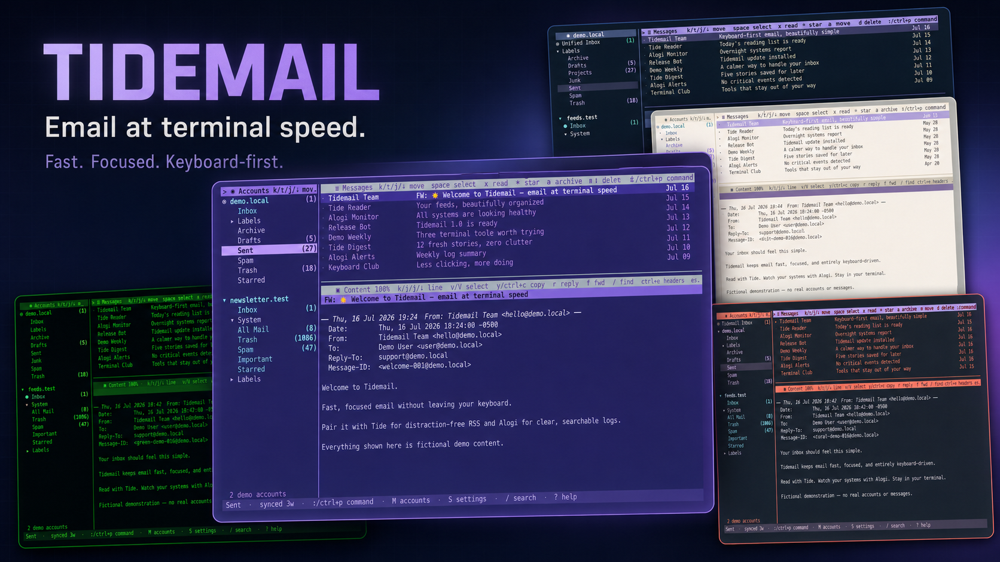

# TideMail

**Mail for people who live in a terminal.**

TideMail keeps your accounts, message list, and reading pane on one screen. It
speaks IMAP and SMTP, stores its cache on your machine, and gives the keyboard
the good seat.

Need the full settings and shortcut reference? Open the
[setup and usage guide](docs/guide.md).



_One inbox, several built-in themes. 

## Highlights

- **NO config file editing, all in the GUI.**
- **One view for every account.** Read a unified inbox or open any account,
  folder, or label from the same three-pane screen.
- **Send from the right address.** Pick an account from the compose From row.
  TideMail switches its SMTP settings, Drafts folder, From address, and
  signature with it.
- **Mail state stays in sync.** Read state, stars, archive, move, and delete use
  IMAP. Changes made in Gmail or another client return to TideMail on sync.
- **A few seconds to change your mind.** Press `Ctrl+Z` to stop a queued send or
  undo a pending delete, archive, or move.
- **Unsubscribe without hunting for a footer.** Press `Ctrl+U` while reading to
  use the message's unsubscribe header or labeled unsubscribe link.
- **Compose your way.** The standard editor supports text selection, the system
  clipboard, undo and redo, and word movement. You can switch on Vim motions
  and commands instead. Optional AI tools can summarize mail, proofread a
  draft, and build local filters from plain English.
- **Readable by design, in every theme.** Text, selection highlights, and the
  focused-pane border are all checked against WCAG-style contrast minimums
  (4.5:1 for text, 3:1+ for large text and UI elements like borders) across
  every built-in theme, enforced by automated tests.

## Install

Linux and macOS builds are available for Intel and ARM machines.

```bash
curl -fsSL https://raw.githubusercontent.com/allisonhere/tidemail/main/install.sh | sh
```

The installer writes to `~/.local/bin` by default, so it should not ask for a
system password. Set `INSTALL_DIR=/path/to/bin` on the `sh` command if you want
a different writable destination. If an older `tidemail` earlier on `PATH`
would still run first, the installer removes it when possible or prints the
exact cleanup command.

You can also grab an archive from the
[latest release](https://github.com/allisonhere/tidemail/releases/latest).

## One screen, three useful panes

The left pane holds accounts and folders. The upper-right pane shows the current
message list. The reading pane stays below it, so opening a message never hides
the rest of your inbox.

Use `j` and `k` to move. Press `Tab` to cross panes. Hit `?` whenever you forget
a key. TideMail keeps the help screen inside the app and lets you search it.

## A normal day in TideMail

- Press `s` to sync the current mailbox. Press `F` to sync every folder.
- Mark messages with `Space`, then archive, move, delete, or change read state as
  a group.
- Press `/` to search the local message cache across accounts.
- Use `*` for a server-backed star. The next sync picks up star changes from
  Gmail and other clients.
- Open a message and press `r` to reply, `f` to forward, or `Ctrl+U` to use its
  unsubscribe header.

Delete, archive, and move wait six seconds before TideMail sends them to the
server. `Ctrl+Z` restores the last queued action.

## Compose with the right account

The From row becomes an account picker when you have more than one sender.
TideMail uses the chosen account for SMTP, drafts, the From address, and its
signature. Replies, forwards, and reopened drafts use the same picker.

To, CC, and BCC suggest saved contacts first. TideMail follows with addresses
found in mail you have synced. You can manage contacts in the app and move them
through vCard files.

TideMail saves the draft while you type. A sent message waits five seconds by
default, which gives `Ctrl+Z` time to reopen it. Set the delay to `0` if you want
mail to leave at once.

The standard compose editor supports Shift-selection, clipboard shortcuts,
undo and redo, word movement, and Home/End. Turn Vim mode on in Settings if you
prefer commands such as `dw`, `dd`, `:w`, and `:q`.

## Mail state belongs to the server

Read state, stars, archive, move, and delete sync through IMAP. TideMail keeps a
local SQLite cache for speed and search, then reconciles it with the server on
sync. By default an account uses IMAP IDLE, so mail lands as the server
announces it (`sync_minutes = 0`); interval polling stays available for servers
that need it, and `-1` keeps an account manual-only.

Drafts live under the selected sender account. Sent messages use that account's
SMTP settings. TideMail detects common Archive and Trash folder names, including
Gmail labels.

## Search, links, and attachments

Global search stays active while you move through results. The content pane can
find text inside the open message, walk links, copy a visual selection, and save
attachments to a folder you choose.

TideMail renders HTML mail as terminal text and does not load remote images.
Full headers are one `Ctrl+E` away, with SPF, DKIM, and DMARC results called out
in color.

## Optional AI tools

Connect OpenAI, Claude, Gemini, or a local Ollama server if you want message
summaries and a compose proofread. TideMail can also turn a plain-language mail
rule into a local filter that runs without an AI call for each message.

AI stays off until you configure a provider.

## Keys worth learning

| Key | Action |
|---|---|
| `j` / `k` | Move down or up |
| `Tab` / `Shift+Tab` | Move between panes or compose fields |
| `Enter` | Open a message, folder, draft, or picker |
| `c` | Compose |
| `r` / `f` | Reply or forward from the reading pane |
| `Space` | Select a message for a bulk action |
| `a` / `m` / `d` | Archive, move, or delete |
| `x` | Toggle read state for selected messages |
| `*` | Toggle the IMAP star |
| `/` | Search messages |
| `Ctrl+Z` | Cancel a queued send or undo a queued message action |
| `Ctrl+U` | Unsubscribe while reading; cycle sender while composing |
| `Ctrl+E` | Show or hide full headers |
| `M` / `S` / `T` | Accounts, settings, or themes |
| `:` / `Ctrl+P` | Command palette |
| `?` | Searchable help |
| `q` | Quit |

## First account

Press `M`, add your incoming and outgoing mail settings, then save with
`Ctrl+S`. Gmail, Yahoo, and iCloud require an app password — or, for Gmail, an
OAuth sign-in (see below).

TideMail stores passwords, AI keys, and OAuth refresh tokens in libsecret on
Linux or Keychain on macOS. If `secret-tool` is missing on Linux, TideMail falls
back to `~/.config/tidemail/config.toml`, so protect that file.

### Gmail with OAuth (optional)

Instead of an app password, a Gmail account can sign in with OAuth. TideMail
ships no OAuth client, so you supply your own (free, no Google verification for
personal use):

1. [Google Cloud Console](https://console.cloud.google.com/) → new project.
2. **APIs & Services → Enable APIs → Gmail API** → enable.
3. **OAuth consent screen** → External. Add your own address as a **test user**.
   For a refresh token that doesn't expire every 7 days, also **Publish** the app
   to Production (a single-user project needs no verification — click through the
   "unverified" notice).
4. **Credentials → Create OAuth client ID → "TVs and Limited Input devices"**
   (or "Desktop app" if you prefer the paste-back flow).
5. Export the credentials before launching TideMail (or put them under
   `[oauth]` in `config.toml`):

   ```sh
   export TIDEMAIL_GOOGLE_CLIENT_ID=xxxx.apps.googleusercontent.com
   export TIDEMAIL_GOOGLE_CLIENT_SECRET=xxxx
   ```

6. In TideMail: `M` → add account → provider **Gmail**. The **Auth** row's
   `‹ ›` selector picks App password or OAuth; with OAuth selected press
   `Ctrl+O`. A short code and URL appear — open the URL on any device, approve,
   and TideMail finishes signing in. Save with `Ctrl+S`.

The refresh token is kept in the keychain and used to mint short-lived access
tokens for IMAP and SMTP. If it is ever revoked, TideMail shows a
"sign-in expired — press M to re-authenticate" hint.

```toml
theme = "lavender-fields-forever"

[display]
send_delay_seconds = 5
compose_vim = true

[[account]]
name = "Personal"
imap_host = "imap.example.com"
imap_port = 993
imap_tls = true
smtp_host = "smtp.example.com"
smtp_port = 587
smtp_tls = true
user = "mira@example.com"
from = "Mira Chen <mira@example.com>"
signature = "Mira\nSent with TideMail"
sync_minutes = 0  # push via IMAP IDLE; N polls every N min, -1 is manual only
```

Config lives at `~/.config/tidemail/config.toml`. TideMail puts its SQLite cache
at `~/.local/share/tidemail/mail.db` unless `XDG_DATA_HOME` points elsewhere.

## Build it

TideMail requires Go. Clone the repository, build, and run the binary:

```bash
git clone https://github.com/allisonhere/tidemail
cd tidemail
go build -o tidemail .
./tidemail
```

Run the test suite with:

```bash
go test ./...
```

## Under the hood

[Bubble Tea](https://github.com/charmbracelet/bubbletea) runs the application
loop. [Lipgloss](https://github.com/charmbracelet/lipgloss) handles terminal
layout and color.

You can reuse two parts as standalone Go libraries:

- [ripple](https://github.com/allisonhere/ripple), the compose editor
- [tideui](https://github.com/allisonhere/tideui), the multi-pane TUI toolkit
